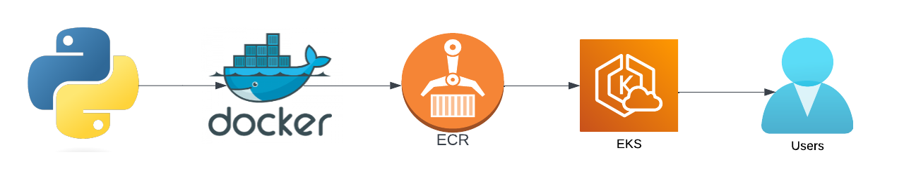
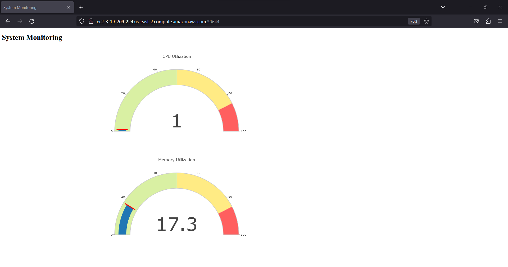

# Cloud_native_monitoring_app
Cloud Native Monitoring App Deploy on AWS

### Architectural Diagram

### Output Screenshot

[Blog Post Link](https://dev.to/aws-builders/how-i-built-my-personal-blog-site-using-aws-services-51l7).

### Step for run application.

- Step 1 : Clone github repository.

- Step 2 : Build docker image.

- Step 3 : Run docker image locally.

- Step 4 : Create AWS ECR repository and push image.

- Step 5 : Create AWS EKS Cluster & Deploy application.